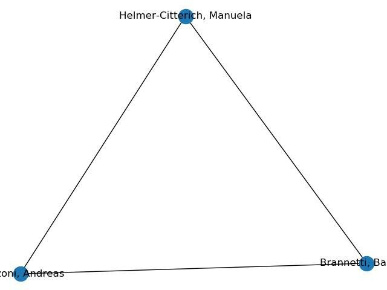

## Project: Frequently Asked Questions (F.A.Q.)

**Question:** Are the ids specified between brackets (eg in the field “author”) optional?

**Answer:** Yes, they are. It is entirely possible that an item does not have any id and, thus, it is not accompanied by any pair of square brackets.

<hr />

**Question:** In the function do_coauthor_graph, do I have to consider only the coauthors that have an id specified?

**Answer:** No, you do not. Instead, you have to consider all the coauthors. The only mandatory requirement is that the starting author must be identifiable by means of an id. All the coauthors who don’t have any id specified are still author of some articles, but the point is that you cannot disambiguate them — ie you cannot say that two authors of two distinct articles sharing the same name are actually referring to the same real world person unless they have the same id specified.

<hr />

**Question:** Do I have to use the wildcards for partial matching?

**Answer:** Yes. All the functions that enable the use of wildcards for searching something, by default (ie when no wildcards are specified) works with a perfect match for an item. For instance, if you try to look for all the rows that contains “Peroni, Si” as one of the authors, then only the rows which contains exactly that name will be returned — thus, the authors (items) “Peroni, Silvio” and “Peroni, Silvano” do not match. If you want to match them as well, the query should be “Peroni, Si*”.

<hr />

**Question:** Do we need to implement the wildcard match ourselves? Or are they automatically recognised by python itself?

**Answer:** You can use whatever mechanism and/or external library you prefer in the implementation of any of the function. The important thing is that it does what I ask you to do.

<hr />

**Question:** Are we supposed to assume that authors with the same name are the same person or that they are all different people?

**Answer:** You can say that two authors are the same if and only if they have the same id.

<hr />

**Question:** About the do_coauthor_graph function, In the levels following the first, do we also have to consider the authors who have already appeared in the previous levels? I will give an example. Consider a single cell with the following authors: "Brannetti, Barbara; Zanzoni, Andreas; Helmer-Citterich, Manuela \[orcid: 00000001-9530-7504\]". If I invoke the coauthor_graph ("\[orcid: 00000001-9530-7504\]", 2) function on this single cell I get a triangle, because they are all coauthors of all. Or do you want the starting author to remain in the center?



**Answer:** The figure provided explain exactly what it should happen. The fact that the author will appear in the "centre" of the graph is just an intuitive notion I provided in the text of the function, so as to convey the fact that such an author was the "originator" of the graph. Since you will have to return a graph in Python (and not its visual representation), being in the "centre" is something that is not represented at all in the graph.

Just an additional thing, about the way you have called the function: the "\[\]" are not part of an id – it is just a markup we use in the data to say "look, here is where I will put ids". Thus, the function should be called as follows:

```coauthor_graph("orcid:0000-0001-9530-7504", 2)```

<hr />

**Question:** What is the meaning of "item"? Is it a row of the csv table (corresponding to an article) or is it the content of a single cell belonging to a row?

**Answer:** An "item" is anything in the data that can (potentially) be referred with an identifier. Thus, it can be the article described by a row in the data, an author of such article, its publisher, etc.

<hr />

**Question:** In the do_get_ids function should we return the ids (first column of the table) or the identifiers of the field matching with str_value? In the second case, if str_value is found in a field without identifiers, what should we return?

**Answer:** You should return always the identifiers in the first column of the table. In addition, you should also return all the identifiers of all the fields matching the str_value if and only if such identifiers are specified, of course.

<hr />

**Question:** How should we use field_set? Is it the list of fields where we have to search str_value? Or is it the list of fields of which we want the identifiers as result? In this second case what should match str_value?

**Answer:** The parameter field_set is the set of fields where the function must search str_value.

<hr />

**Question:** In do_get_by_id which strings should we obtain as a result? The strings just in the fields containing the wanted id? Or all the strings in the rows containing the id?

**Answer:** Each string is the textual representation of the row where the input identifier appear. The textual representation to use is the one introduced in the do_filter function.

<hr />

**Question:** You said that when field_set is None the match must be searched in all the fields. Is “all the fields” an implicit reference to all the fields that can actually contain ids ( = venue, author and publisher)? 

**Answer:** "All the fields" means all the fields.

<hr />

**Question:** When we’re using wildcards, if the * is at the end of a string (eg. Peron*), the function should match all the items that START with “Peron”, and NOT the ones which contain the string “Peron”, right? Is it correct yo say that if I want to get this other result I should use “\*Peron\*” ?

**Answer:** It is correct.

<hr />

**Question:** In the coauthor_graph function, should the nodes contain just the author ID or both the name and ID or just the name?

**Answer:** The name always, plus all the ids between square brackets, separated by “;” as usual when they are defined for an author.

<hr />

**Question:** I have a doubt about the possibility that one of the input of our functions may be "None". When I do the tests on my function, should I insert, for example, an empty list (none input is given by the user), or should I literally write 'None' as input?

**Answer:** The None value can be specified only where I explicitly say so in the specification, not everywhere. On the contrary, if the function takes in input a list, for instance, then an empty list is a reasonable input.

<hr />

**Question:** Related to do_get_ids: suppose we have more ids for the item matched (i.e. str_value \[orcid:1234; orcid:3579\]).
Which is the correct output?

1. {'orcid:1234; orcid:3579'}
2. {'orcid:1234', 'orcid:3579'}
3. both

**Answer:** You have to return a set of items, where each item is an identifier. Only one of your answers is compliant with this, i.e. 2.

<hr />

**Question:** If the matching happens in more than one article, do we get a set per article or a general set with ids of both articles?

**Answer:** The function description is clear in this sense, it says it should return just one set.

<hr />

**Question:** Can every string of every field be defined by an id?

**Answer:** Only the fields "id", "author", "venue" and "publisher" can contain identifiers.

<hr />

**Question:** Do ids always have colons between brackets? 

**Answer:** The syntax followed for defining ids is specified in the slide "Example of CSV metadata", and will be strictly followed in the data.

<hr />

**Question:** In the CSV example slide you wrote: id(list of strings), author(list of strings). Does that mean that we have to transform those items in a list of strings, or we can also use for instance a dictionary? I mean, is it just an example, a suggestion or an instruction?

**Answer:** The term “list of strings” there has been used to say that in the cell are indeed specified more than one value, each of which is separated by using “;”. How to handle this in your Python representation of the data (ie deciding which data structure to use) is totally up to you.

<hr />

**Question:** A question about do_coauthor_graph. When an author does not have an ID, we should consider them in the graph but we cannot disambiguate them if they have the same name. For example, consider the scenario that the following two lines are the author lists for two publications:

```
‘Smith, John: [orcid: 12345]; Smith, Jane’
‘Smith, John: [orcid: 12345]; Smith, Jane’
```

In this case, if our root is John Smith, it will be connected to two distinct authors called Jane Smith in the first level, and hence, when going one level deeper in creating the graph, we can not find the other coauthors of any of those two Jane Smith nodes because we can never know which one it is in any publication, meaning that authors who don’t have IDs can only ever have one neighbor node and if John Smith has written 100 articles with Jane Smith we will have 100 distinct Jane Smiths. It is also the case for do_author_network. This seems to me to render the final graphs almost useless and extremely confusing, but it’s my understanding of the project explanation. Is this correct?

**Answer:** It is correct. However, consider that if you have three authors in an article, eg ‘Smith, John \[orcid:a\]; Doe, Jane; Brown, Charlie’, and ‘orcid:a’ is the id of our starting node, at level 1, you create one edge between the nodes ‘Smith, John’ and ‘Doe, Jane’ and another edge between ‘Smith, John’ and ‘Brown, Charlie’. However, at level 2, you create also the edge between ‘Doe, Jane’ and ‘Brown, Charlie’.

<hr />

**Question:** About the do_filter function: in the textual representation of the row how should be represented the name of a person with more than one given name?
For example: "Mattheakis, Larry C" is returned as:

* "Mattheakis, L",
* "Mattheakis, LC",
* "Mattheakis, L C" or something else?

**Answer:** It’s ‘Mattheakis LC’

<hr />

**Question:** About the do_filter algorithm, it takes as input the given data and a field_value_list which is a list of tuple each containing two values, where the first value is the field where to search and the second the value to search. Can I have that in the following forms:

1. field_value_list = \[("author", "Peroni")\]
2. field_value_list = \[("author", "Peroni, Silvio")\]
3. field_value_list = \[("author", "Peroni Silvio")\]? 
4. field_value_list = \[("author", "Peroni")\]? 

**Answer:** All the forms are fine. The point is that the second element of the tuple will be evaluated similarly to what happen with str_value in the function go_get_ids. Remember that you can specify more than one tuple - in which case the row matches if all the tuples in field_value_list are matching for that row.

<hr />

**Question:** If I have a field_value_list = [("title", "science")] and in data there are "Science for everyone" and "Learning science" the output will be both of them or only the one that starts with the value (so "Science for everyone")? 
And if it doesn't contain any wildcard, will it return only the articles with "science" in the title, and not those with for example "sciences", right? 

**Answer:** None of them. In fact, there is no cell that contains only "science". To get both of them, you should use "*science*". To get only the first one, you should do "science*".

<hr />

**Question:** When the field_value_list is None, the algorithm look for any row in data. It's not the same as when the field_value_list is empty, so there is not any filters to be applied and so the algorithm has to look for any row in data?
Is field_value_list = None equal to field_value_list = \[ \]?
And finally when field_value_list is None, our function will be written as do_filter(data, None)?

**Answer:** Let's agree that the behaviour of the function if I pass an empty list to field_value_list is similar to the one if I specify None. Finally. The parameters of the function does not change. This situation is valid also for field_set in do_get_ids and do_get_by_id, if field_set is an empty set.

<hr />

**Question:** About the tree of venues function. Sometimes in rows of data the ‘issue’ field is something like ‘3-4’. In this case, should we add two nodes, ‘3’ and ‘4’, to the tree, or should we add a single node ‘3-4’? And might this also happen with volumes?

**Answer:** They should not be two node, there is just one issue that is "named" "3-4". It may happen also for volumes, but that should not be an issue considering my answer to the previous point.

<hr />

**Question:** Is there a limit on the number of Given name initials per author that we should return in do_filter?

**Answer:** You have to return the initials of all the given names an author has.

<hr />

**Question:** A question about do_coauthors_graph. In the csv there are authors with the same id but slightly different strings, such as Awrejcewicz, J. \[orcid: 00000003-0387-921X\] and Awrejcewicz, Jan \[orcid: 00000003-0387-921X\]. Obviously they must be considered as a single author. The question is: which of the two do I put in the graph? The first? The second one? Or do I also have to use the text representation <Family Name> <Given Name Initials> for the graph?

**Answer:** Even text representation may fail in some cases (e.g. considering the fictional case of "Awrejcewicz, Jan Jakob \[orcid: 00000003-0387-921X\]" and "Awrejcewicz, Jan \[orcid: 00000003-0387-921X\]").

Thus, it is totally up to you to choose which string to prefer to refer to the author name, but the important thing is that the id between brackets is present.

<hr />

**Question:** About the previous question/answer, in the case of “Awrejcewicz, J.” without ID, can we assume that he’s the same person or we cannot?

**Answer:** The only mechanism you have to claim that two authors are actually referring to the same person is that they share the same ID. If you don't have it, you cannot claim anything, and in particular you cannot say they actually represent the same person, despite the fact they may have the same name.

<hr />

**Question:** About the function do_coauthors_graph, if two authors have the exact same name, their nodes have the same name and therefore only one node is created, being like keys in a dictionary. Do we have to prevent this from happening by giving different names to the various nodes with the same name but no id?

**Answer:** Yes. In this case, you need to have two distinct nodes.

<hr />

**Question:** Hi, I have a question about the IDs. In the project explanation, it is mentioned that it’s hypothetically possible that authors, venues, and publishers have more than one ID. In that case, I gather that it’s hypothetically possible that we have a such thing in three rows:

```
John Smith [orcid: 12345]
John Smith [orcid: 12345; some_other_id: 54321]
John Smith [some_other_id: 54321]
```

Obviously these authors are the same, but might this scenario actually happen? Or should we consider only the entire collection of IDs for assessing whether two authors are the same?

Moreover, if we have a sample function get_by_id(‘some_other_id: 54321’, \[‘author’\]), will we have to return the fields in which only ‘orcid: 12345’ is used as well?

**Answer:** Yes, that situation may happen, and yes, they are all the same author, and should be treated as the same entity.

Note that, as you noticed, this affects also other functions, such as the ones that imply the use ids. Thus, to answer to your last question: yes, you have to return also the rows where ‘orcid:12345’ is used.

<hr />

**Question:** n field_value_list the string matched can be between square brackets? For example the tuple ('author', 'orcid:1234') should match 'Smith, Jane \[orcid:1234\]'?

**Answer:** No, all the ids indicated between the square brackets are not part of the string value of a particular cell, since they are just additional metadata used to referring to that entity.

<hr />

**Question:** A question about the do_filter function: I know that we can have more than one tuple in field_value_list and, and this case we have to look for a multiple match, but is it possible that the first item of the tuple is itself a list or something similar which can contain more than one field specified?

**Answer:** No, the tuple has just the two values as described in the slides.

<hr />

**Question:** Is possible that the metadata sample executed in the exam presents wrong formatting of text (i.e. missing whitespaces after semicolons or author's names with no comma or no surname)? If so, our algorithm should handle those random edge cases to be considered correct or not?

**Answer:** Having no surname is kind of complex for an author, but I would say that it is possible that no given name is provided, if the information are not available. About the space after the ";", it may be possible that one or multiple spaces are there, or no at all. Thus, you should handle this situations. So, in principle, all these situations may happen:

- `"Doe, John;Smith, Jane"`
- `"Doe, John; Smith, Jane"`
- `"Doe; Smith, Jane"`
- etc.

<hr />

**Question:** A question about the def do_retrieve_tree_of_venues. The slide says to return a “tree”, without any specifications about the data’s structure we have to use. Are we free to implement it for example using a class? 

**Answer:** I would suggest to use `anytree` for implementing the tree - and thus you have to return the root node of such tree you will build so as to return "a tree"

<hr />

**Question:** A question about the def do_retrieve_tree_of_venues. I don’t understand well the format of “no_ids” parameter. For example if I want to esclude the venue "Comparative and Functional Genomics \[issn:1531-6912; issn:1532-6268\]", what “no_ids” should contain, the issn code or the name of the venue?

**Answer:** no_ids must be a set of identifiers only - thus, if you want to exclude the venue in the example, you can specify the set {issn:1531-6912}

<hr />

**Question:** Is it possible to have an example of the output for the function do_get_by_id?

**Answer:** You can find an example in the following slide, at the very end: https://comp-think.github.io/2019-2020/slides/14%20-%20Project.html#/10.

<hr />

**Question:** Is it possible that in the tuples one or both of the elements are None or an empty string? If yes, what should we do in that case?

**Answer:** No, it is not.